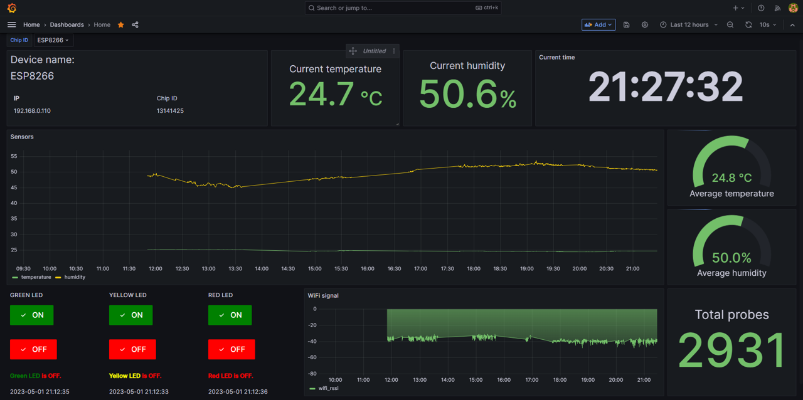
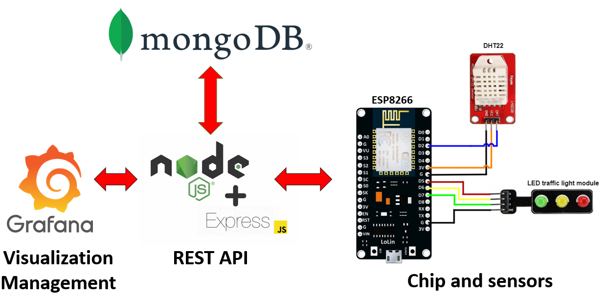
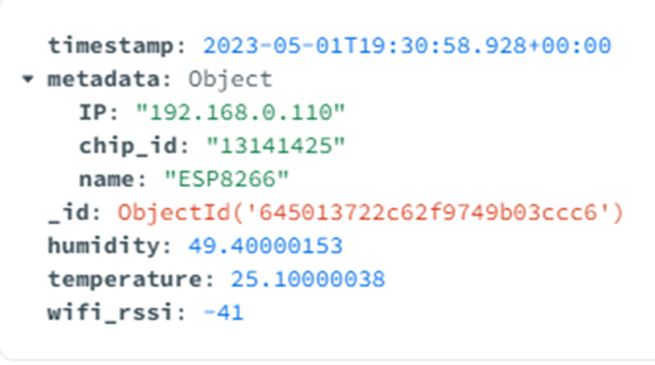
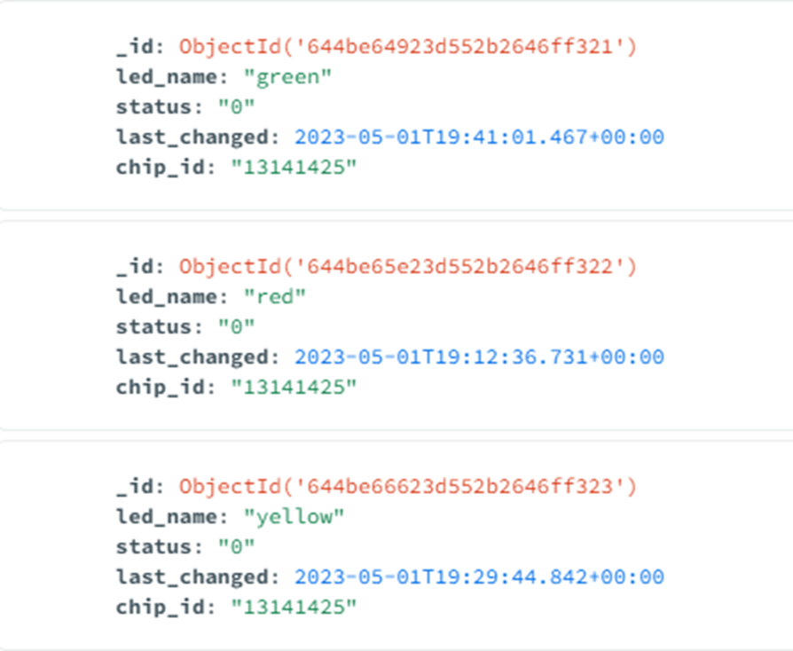
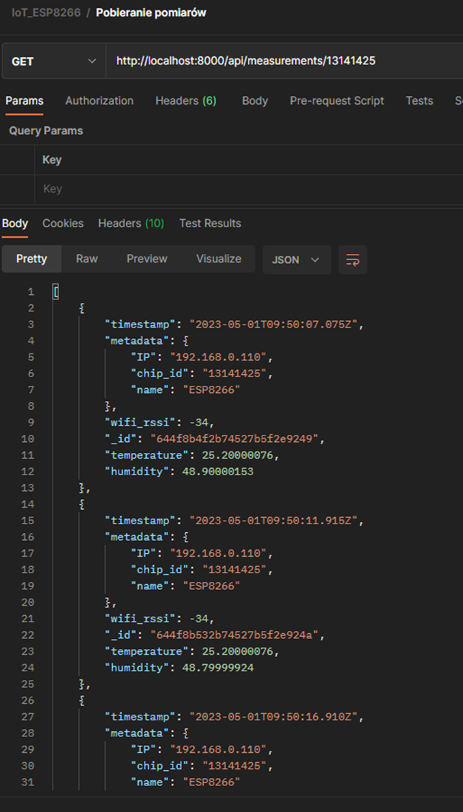
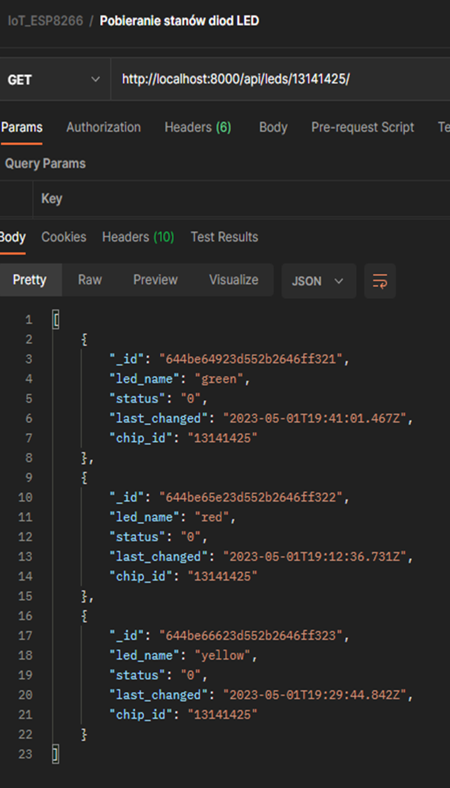
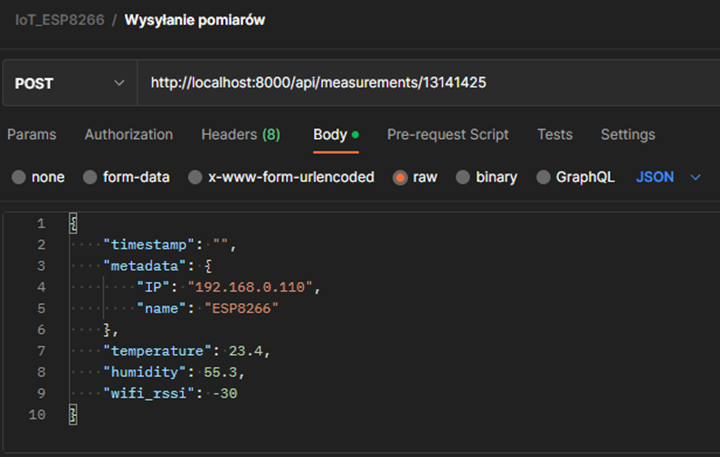

<h2 align="center">
    
    Grafana and REST API for smart home system 
</h2>

Simple and powerful app for controlling smart home devices.

<p align="center">
    <a href="#features">Features</a>&nbsp;&nbsp; | &nbsp;
    <a href="#getting-started">Getting started</a>&nbsp; | &nbsp;
    <a href="#used-technologies">Technologies</a>&nbsp; | &nbsp;
    <a href="#rest-api-endpoints">REST API Endpoints</a>&nbsp; | &nbsp;
    <a href="#screenshots">Screenshots</a>
</p>

# Features
* You can save and show measurements from sensors and turn on/off LEDs on many devices
* By default, the app is optimized for storing temperature and humidity
* Scalable for many IoT devices and sensors
* REST API available
* Optimized for ESP8266 chips
* Measurements and LEDs status are stored in MongoDB database
* Grafana dashboard can be used for visualization and controlling


# Proposed architecture



# Getting started
1. Clone this repo
```
git clone https://github.com/krzysztofhewelt/esp8266-projects.git .
```

2. Change WiFi credentials, REST API URL server, measurement interval, device name in ``sensors/sensors.ino`` file
```
#define WIFI_SSID "your_ssid"
#define WIFI_PASSWORD "your_password"

unsigned long previousMillis = 0;   // Stores last time measurements was published
const long interval = 5000;        // Interval at which to publish sensor readings
const String rest_api_server = "http://192.168.0.100:8000/api";  // REST API server location
const String device_name = "ESP8266";  // device name
```
Next, connect all sensors and flash your ESP8266.

3. Copy ``.env.example`` to ``.env`` and change MongoDB credentials. You can use [MongoDB Atlas](https://www.mongodb.com/atlas/database) hosted in cloud.
```
MONGODB_CONNECTION_STRING="mongodb+srv://<USER>:<PASSWORD>@cluster0.rthwv.mongodb.net/?retryWrites=true&w=majority"
MONGODB_DATABASE="iot_devices"
```

4. In your MongoDB database create two collections:
* **measurements**: check time series option
* **leds**: normal collection (not time series)

5. Install all dependencies
```
npm install
```

6. Run REST API server
```
node index.js
```

7. In Grafana, you must import ``grafana_dashboard.json`` dashboard. Change IP addresses to REST API if necessary.

# Used technologies
* Express.js framework as base
* MongoDB as database
* CORS and dotenv
* Prettier and ESLint
* Grafana for visualization (provided by Docker)
* IDE: WebStorm and Arduino


# REST API Endpoints
REST API provides ability to show and save measurements, show status and control LEDs. 

## Controlling LEDs:
* GET `/api/leds/{chipID}` - get status of all LEDs connected to given chip ID. \
Example response:
```json
[
  {
    "timestamp": "2023-05-01T09:50:07.056Z",
    "metadata": {
      "IP": "192.168.0.110",
      "chip_id": "13141425",
      "name": "ESP8266"
    },
    "wifi_rssi": -34,
    "_id": "507f1f77bcf86cd799439011",
    "temperature": 25.2000076,
    "humidity": 40.2000076
  },
  {
    "timestamp": "2023-05-01T09:50:11.056Z",
    "metadata": {
      "IP": "192.168.0.110",
      "chip_id": "13141425",
      "name": "ESP8266"
    },
    "wifi_rssi": -34,
    "_id": "611f1f77bcf86cd79943141",
    "temperature": 25.2000145,
    "humidity": 40.2000081
  },
  ...
]
```

* POST `/api/leds/{chipID}/{ledName}/{newStatus}` - changes status (turns off/on) of given LED name and chip ID. \
Example: `/api/leds/13141425/red/1`

## Measurements:
* GET `/api/measurements/{chipID}` - fetch all measurements from given chip ID. \
Example response:
```json
[
  {
    "_id": "18ab1f77bcf86cd79943141",
    "led_name": "green",
    "status": 0,
    "last_changed": "2023-05-01T09:50:11.056Z",
    "chip_id": "13141425"
  },
  {
    "_id": "41cd1f77bcf86cd79914141",
    "led_name": "red",
    "status": 1,
    "last_changed": "2023-05-02T09:50:11.056Z",
    "chip_id": "13141425"
  },
  ...
]
```

* GET `/api/measurements/{chipID}/{startDate}/{stopDate}` - fetch all measurements from given chip ID in given date range. \
Example response same as above.

* POST `/api/measurements/{chipID}` - save one measurement from given chip ID. \
Example payload:
```json
{
  "timestamp": "",
  "metadata": {
    "IP": "192.168.0.110",
    "name": "ESP8266"
  },
  "temperature": "23.4",
  "humidity": "40.11",
  "wifi_rssi": -30
}
```

# Screenshots






