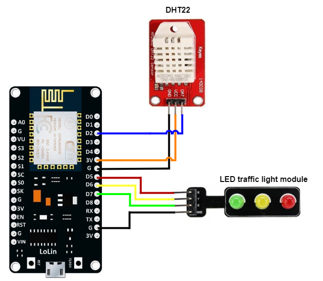
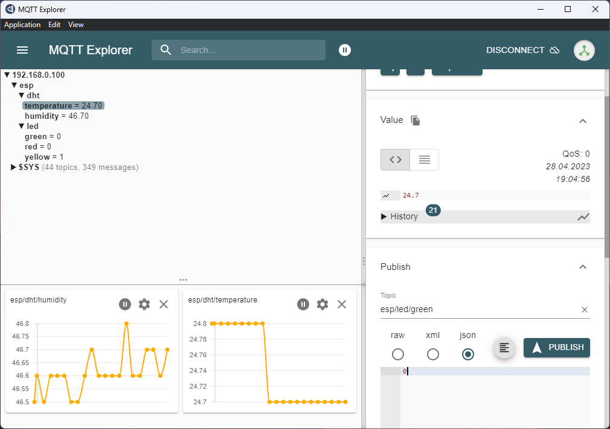
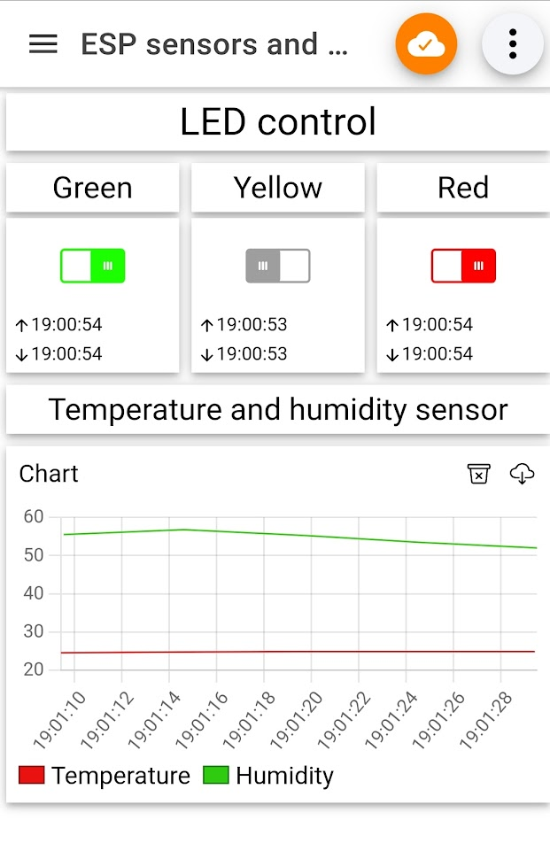

# About project
Simple project built with ESP8266, DHT22 and LED traffic light module to test MQTT protocol. You can turn off/on LEDs from your computer, smartphone remotely. You can also watch temperature and humidity in-real time.

# ESP8266 pinout
[](screenshots/ESP8266_pinout.png)

# MQTT topics
This program uses a few MQTT topics that you can subscribe and publish:
* temperature - "esp/dht/temperature"
* humidity - "esp/dht/humidity"
* red LED - "esp/led/red"
* yellow LED - "esp/led/yellow"
* green LED - "esp/led/green"

# Required software
* Arduino IDE or simillar
* MQTT broker: remote or locally (ex. [mosquitto](https://mosquitto.org/))

# Installation
1. Open file ``mqtt_esp.ino`` in Arduino IDE (or another IDE)
2. Connect device to your computer
3. Install necessary libraries
4. Select device you want to deploy the program
5. Deploy program to the device
6. Use MQTT client (ex. [MQTT explorer](http://mqtt-explorer.com/)) to control LEDs and watch sensor data

# Configuration
**1. WiFi credentials**
```
#define WIFI_SSID "YOUR_SSID"
#define WIFI_PASSWORD "YOUR_PASSWORD"
```
**2. MQTT server**
```
#define MQTT_HOST IPAddress(192, 168, 0, 100)
#define MQTT_PORT 1883
```
**3. Pinout (if your is different)**
```
#define DHTPIN D2
#define RED_LED D5
#define YELLOW_LED D6
#define GREEN_LED D7
```
**4. DHT type (if you are using DHT11)**
```
#define DHTTYPE DHT22
```
**5. Measurement interval (miliseconds)**
```
const long interval = 5000;
```
**6. MQTT topics**
```
#define MQTT_PUB_TEMP "esp/dht/temperature"
#define MQTT_PUB_HUM "esp/dht/humidity"
#define MQTT_SUB_RED_LED "esp/led/red"
#define MQTT_SUB_YELLOW_LED "esp/led/yellow"
#define MQTT_SUB_GREEN_LED "esp/led/green"
```

# Example usage
## MQTT Explorer
[](screenshots/mqtt_explorer.png)

## IoT MQTT Panel (Android)
[](screenshots/iot_mqtt_panel.png)
